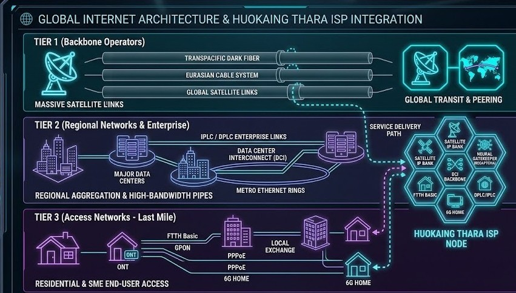

# isp_announcement
# HUOKAING THARA ISP — Official Regulatory & Operations Portal



An interactive, high-tech executive portal for **HUOKAING THARA ISP**, featuring 5-Phase Infrastructure CAPEX tracking, multi-tier budget allocations, real-time epoch system clock synchronization, and an integrated AI Metavoice executive briefing audio engine.

---

## 🚀 Key Features

* **5-Phase Infrastructure & Compliance Matrix:**
  * **Phase 01 (`IDX-FTTH-01`):** Core Fiber & FTTH Infrastructure (បណ្តាញខ្សែកាបអុបទិក) — Base: **$8.40M** | Max/Overflow: **$14.20M**
  * **Phase 02 (`IDX-BRAS-02`):** PPPoE & BRAS Authentication Layer (ប្រព័ន្ធផ្ទៀងផ្ទាត់ BRAS) — Base: **$6.20M** | Max/Overflow: **$11.50M**
  * **Phase 03 (`IDX-SAT-03`):** LEO Satellite Backhaul & Satellite Redundancy (បណ្តាញរណបបម្រុង) — Base: **$4.10M** | Max/Overflow: **$7.80M**
  * **Phase 04 (`IDX-NAT-04`):** CGNAT & BGP Core Data Peering (ប្រព័ន្ធបញ្ជូនទិន្នន័យ) — Base: **$11.30M** | Max/Overflow: **$19.50M**
  * **Phase 05 (`IDX-REG-05`):** Telecom Regulation, Sovereign Spectrum & Government Partnerships (ច្បាប់ទូរគមនាគមន៍) — Base: **$18.50M** | Max/Overflow: **$35.00M**
* **CAPEX Dynamic Tracking:** Automatic totals computing base operational deployment at **$48.50M USD** with capacity expansion handling up to **$88.00M USD**.
* **AI Metavoice Executive Briefing:**
  * Multi-language Speech Synthesis supporting Khmer (Phase 5 Regulatory Briefing & General), English (US), Chinese, Vietnamese, and Thai.
  * Real-time CSS CSS-animated Metavoice audio frequency waveform visualizer.
* **Cyberpunk / Glassmorphism UI:**
  * Responsive layout with full-viewport cover canvas, holographic grid styling, custom glitch title headers, and dynamic system status telemetry logs.

---

## 🛠️ Tech Stack & Dependencies

* **Frontend Structure:** HTML5 / Semantic Elements
* **Styling & Visual Effects:** CSS3 (Flexbox/Grid layout, Glassmorphic overlays, Custom Animations)
* **Scripting & Interactivity:** Modern ES6 JavaScript (`script.js`)
* **Localization / Translation:** Integrated Google Translate Engine Widget
* **Canvas Visuals:** HTML5 `<canvas id="hologram-canvas">` background render loop

---

## 📁 Project Directory Structure

```text
├── index.html            # Main Portal Page Layout
├── style.css             # Glassmorphism, Visualizer & Layout Styles
├── script.js            # Epoch Stabilizer, Audio Engine & Interactive Logic
└── isp_announment.jpg    # Visual Banner Asset & Site Favicon
